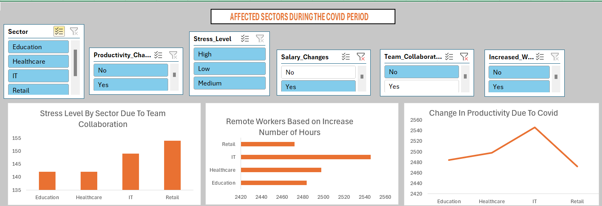
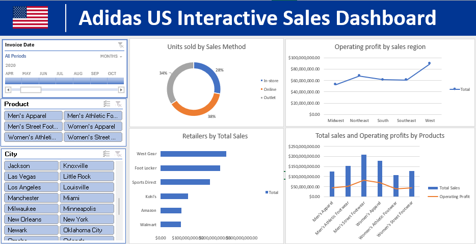

# Data Analytics Portfolio
# Project 1
**Title**: [Affected Sectors During The Covid Period](https://github.com/OlaMuizz/OlaMuizz.github.io/blob/main/Covid%20Dashboard.xlsx)

**Tools Used**: MS Excel (Pivot Chart, Pivot Tables, Conditional Formatting, Slicers)

**Project Description**: To find the sectors that have 

**Key findings**:

**Dashboard Overview**:

# Data Analytics Portfolio
# Project 2
**Title**: [Adidas US Interactive Sales Dashboard](https://github.com/OlaMuizz/OlaMuizz.github.io/blob/main/Adidas%20Sales%20Dashboard.xlsx)

**Tools Used**: MS Excel (Pivot Chart, Pivot Tables, Conditional Formatting, Slicers)

**Project Description**: 

**Key findings**:

**Dashboard Overview**:

